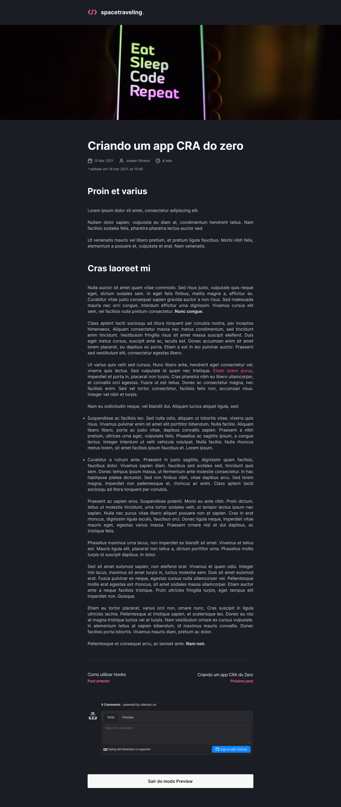

<p align="center">

</p>
<br>

## Sobre o spacetraveling

O spacetraveling é um simples e moderno blog sobre tecnologia.

## Screenshots

|  |  |
:-------------------:|:-------------------:
|  | 


## Tecnologias

Tecnologias e ferramentas utilizadas no desenvolvimento do projeto:

* [Typescript](https://www.typescriptlang.org/)
* [NextJS](https://nextjs.org/)
* [Prismic CMS](https://prismic.io/)
* [Utterances](https://utteranc.es/)
* [Jest](https://jestjs.io/pt-BR/)
* [Date-FNS](https://date-fns.org/)
* [React](https://reactjs.org/)
* [SASS](https://sass-lang.com/)

<br>

## Instalação e uso

```bash
# Abra um terminal e clone o repositório
git clone https://github.com/erikalbuquerque/spacetraveling.git

# Entre no diretório
cd spacetraveling

# Instale as dependências
yarn

# Rode a aplicação
yarn start
```

<br>

Feito com <3 by [Érik Albuquerque](https://github.com/erikalbuquerque)

<left>
  <h4>You can find me around here:</h4>

[](https://www.linkedin.com/in/erik-albuquerque/)
[](mailto:erik.albuquerque.oficial@gmail.com)
<a href="https://www.instagram.com/albuquerik">

</a>
<a href="https://app.rocketseat.com.br/me/erik-albuquerque">

</a>

</left>
